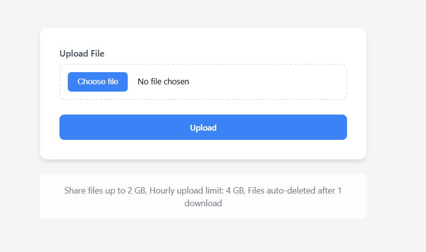

# Link Vault 🔐

A modern, intuitive file sharing application that allows users to securely share files and generate shareable links. Files are automatically deleted after one download, ensuring privacy and efficient storage management.



## ✨ Features

- **Simple File Uploads**: Drag & drop or click to upload files
- **Secure Sharing**: Files are automatically deleted after one download
- **Copy-to-Clipboard**: One-click copy for sharing links
- **Persistent Links**: Links remain visible until new upload
- **Responsive Design**: Works seamlessly on desktop and mobile devices
- **Real-time Feedback**: Visual alerts for all actions
- **Size Limits**:
  - Single file upload: up to 2 GB
  - Hourly upload limit: 4 GB

## 🚀 Quick Start

### Prerequisites

- Node.js (version 14.0 or higher)
- npm or yarn

### Installation

1. Clone the repository:

```bash
git clone https://github.com/adhikareeprayush/Link-Vault
cd link-vault
```

2. Install dependencies:

```bash
npm install
# or
yarn install
```

3. Start the development server:

```bash
npm start
# or
yarn start
```

4. Open [http://localhost:3000](http://localhost:3000) to view it in your browser.

## 💻 Usage

1. Click the "Upload File" button or drag and drop a file into the upload area
2. Wait for the upload to complete
3. Copy the generated link using the "Copy" button
4. Share the link with your recipient
5. The file will be automatically deleted after one download

## 🛠️ Built With

- [React](https://reactjs.org/) - Frontend framework
- [file.io](https://file.io/) - File hosting service

## 📦 Project Structure

```
link-vault/
│
├── src/
│   ├── App.jsx          # App component
│   ├── index.css        # Stylings
│   └── Main.jsx      # Entry Point
│
├── public/
│   └── index.html      # HTML template
│
└── package.json        # Dependencies and scripts
```

## ⚠️ Important Notes

- Files are automatically deleted after one download
- Maximum file size: 2 GB
- Hourly upload limit: 4 GB
- Links are not permanent and will be lost on page refresh
- No registration required for basic usage

## 🔒 Security

- Files are transmitted over HTTPS
- No file data is stored locally
- One-time download links ensure files aren't accessible after first download
- No user tracking or data collection

## 🤝 Contributing

1. Fork the Project
2. Create your Feature Branch (`git checkout -b feature/AmazingFeature`)
3. Commit your Changes (`git commit -m 'Add some AmazingFeature'`)
4. Push to the Branch (`git push origin feature/AmazingFeature`)
5. Open a Pull Request

## 📝 License

This project is licensed under the MIT License - see the [LICENSE](LICENSE) file for details.

## 👥 Authors

- Prayush Adhikari - [GitHub Profile](https://github.com/adhikareeprayush)

## 🙏 Acknowledgments

- [file.io](https://file.io/) for providing the file hosting service
- [React](https://react.dev/) community for the amazing framework
- All contributors who help improve this project

## 📫 Support

For support, email adhikareeprayush@gmail.com or create an issue in this repository.
